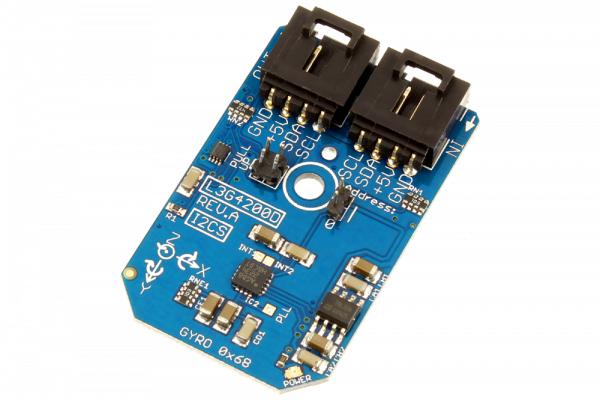

# L3G4200D

The L3G4200D, manufactured by STMicroelectronics, is a low-power three-axis angular rate sensor which provides unprecedented stability of zero rate level and sensitivity over temperature and time.The IC interface is manufactured using a CMOS process that allows a high level of integration to design a dedicated circuit. The L3G4200D has a full scale of ±250/±500/±2000°/sec and is capable of measuring rates with a user-selectable bandwidth.
This Device is available from www.ncd.io 

[SKU: L3G4200D_I2CS]

(https://store.ncd.io/product/l3g4200d-mems-motion-sensor-ultra-stable-3-axis-gyroscope-i2c-mini-module/)
This Sample code can be used with Arduino.

Hardware needed to interface L3G4200D sensor with Arduino

1. <a href="https://store.ncd.io/product/i2c-shield-for-arduino-nano/">Arduino Nano</a>

2. <a href="https://store.ncd.io/product/i2c-shield-for-arduino-micro-with-i2c-expansion-port/">Arduino Micro</a>

3. <a href="https://store.ncd.io/product/i2c-shield-for-arduino-uno/">Arduino uno</a>

4. <a href="https://store.ncd.io/product/dual-i2c-shield-for-arduino-due-with-modular-communications-interface/">Arduino Due</a>

5. <a href="https://store.ncd.io/product/l3g4200d-mems-motion-sensor-ultra-stable-3-axis-gyroscope-i2c-mini-module/">L3G4200D MEMS Motion Sensor Ultra-Stable 3-Axis Gyroscope Sensor</a>

6. <a href="https://store.ncd.io/product/i%C2%B2c-cable/">I2C Cable</a>

L3G4200D:

The L3G4200D, manufactured by STMicroelectronics, is a low-power three-axis angular rate sensor which provides unprecedented stability of zero rate level and sensitivity over temperature and time.The IC interface is manufactured using a CMOS process that allows a high level of integration to design a dedicated circuit. The L3G4200D has a full scale of ±250/±500/±2000°/sec and is capable of measuring rates with a user-selectable bandwidth.

Applications:

• GPS navigation systems

• Appliances

• Robotics etc.

How to Use the L3G4200D Arduino Library

The L3G4200D has a number of settings, which can be configured based on user requirements.
          
1.Data rate setting:The following command is used to set the resolution of sensor for humidity and temperature.

             l3g.setGyroDataRate(GYRO_DATARATE_100_12_5);      // ODR (Hz): 100, Cutoff: 12.5 l3g.setGyroScale(GYRO_SCALE_2000DPS);            // 2000 dps
            
2.Output range selection:The following command is used to set the output range for the sensor.

              l3g.setGyroScale(GYRO_SCALE_2000DPS);            // 2000 dps
